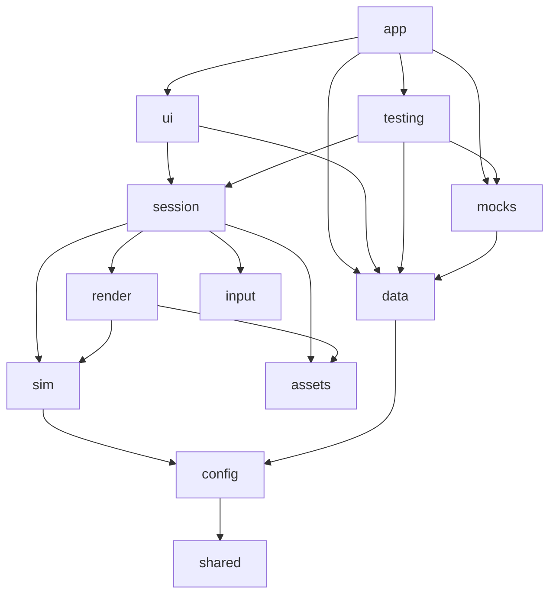
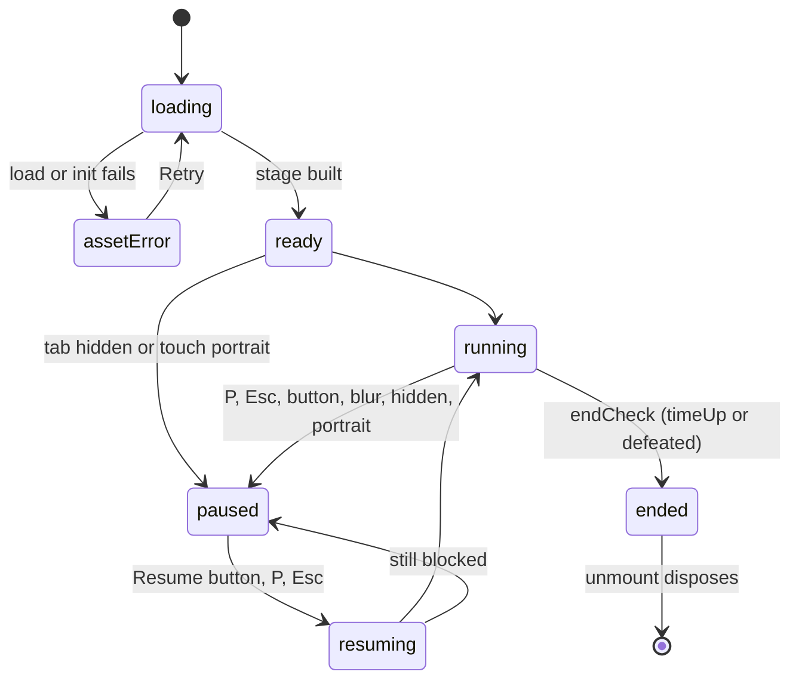
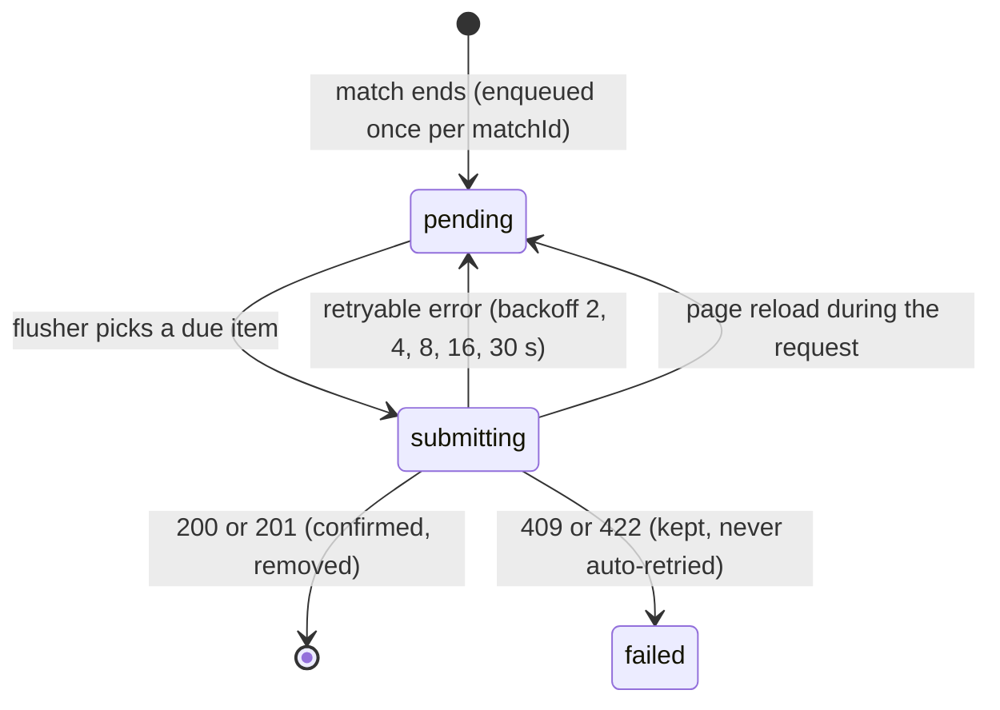

# Pirate Battle — Architecture

This document explains how Pirate Battle is built, as delivered at milestone M7. It follows the outline in §21 of the design
spec, [ARCHITECTURE_SPEC.md](ARCHITECTURE_SPEC.md). Requirement IDs such as `GP-03` or `API-11` refer to
[PIRATE_BATTLE_DESIGN_BRIEF.md](PIRATE_BATTLE_DESIGN_BRIEF.md). Where the code differs from the spec, this document describes the code and names the difference.

## 1. Overview and stack

Pirate Battle is a single-player, top-down naval shooter that runs entirely in the browser (C-03). React draws the menus,
HUD and dialogs. PixiJS draws the arena. A pure TypeScript simulation owns every rule. Ranking and match history are REST
endpoints answered by an MSW service worker in every build, production included (C-04, MSW-06). The game has one hand-authored
arena of 24×14 tiles of 64 px (1536×896 logical px), always fully visible, so matches with the same options are comparable.

| Technology | Version | Job in the game (C-01) |
| --- | --- | --- |
| Vite | 8 | dev server, production build, code splitting (`build.assetsDir: 'static'`) |
| React | 19 | screens, dialogs, HUD, touch buttons; Strict Mode on |
| TypeScript | 6.0, `strict` | the whole codebase; pinned to 6.0 because typescript-eslint does not support 7.x |
| PixiJS | 8.21 | arena, ships, cannonballs, effects, fog, over-ship health bars |
| TanStack Query | 5 | ranking and history queries, and the save mutation that the outbox runs |
| Axios | 1 | the only HTTP client ([http.ts](src/data/http.ts)) |
| MSW | 2 | network-level mocks, 14 scenarios, a fake server database |
| React Router | 8 | real URLs `/`, `/options`, `/log`, `/play`, `/result` |
| Playwright | 1.63 | 38 E2E tests, visual baselines, performance and memory runs |
| Vitest | 5 | six small unit suites (§15) |
| ESLint + eslint-plugin-boundaries | 10 / 7 | layer rules (§2) |

- Movement, combat, collision and AI rules are hand-written in `src/sim` (C-06). The game has no physics engine or game framework, and nothing beyond the brief: no pickups, power-ups or bosses (D-F).
- Delivery (DEL-02): the [Dockerfile](Dockerfile) builds in `node:24-alpine` and serves `dist` from `nginx:1.30-alpine` on `:8080` ([nginx.conf](nginx.conf), [docker-compose.yml](docker-compose.yml)). The author's Caddy reverse proxy terminates TLS on a dedicated subdomain; service workers need HTTPS. nginx falls back to `index.html` only for extensionless paths, serves `/static/*` as immutable, and serves everything else, including `mockServiceWorker.js`, with `no-cache`. The menu footer shows the commit SHA from the `VITE_COMMIT_SHA` build argument.
- The estimate given before starting: "Two days (≈ 28 h): day 1 playable core + Pixi lifecycle on the public URL; day 2 screens, ranking/history with mocks, Playwright, profiling, docs". The git history has one commit per milestone: M0 (scaffold, layer boundaries, Docker) through M7 (performance evidence, documents, Shooter aim, font).
- A clean checkout needs no source asset pack and no private service (C-07, DEL-01). The converted atlases, the built map and the UI sprites are committed; the lockfile, mocks, fixtures and tests are in the repository.

## 2. Layers and dependency rules



An arrow means "may import". The table is in [eslint.config.js](eslint.config.js), and `eslint-plugin-boundaries` fails
`npm run lint` on any other import (`default: 'disallow'`). Every layer may also import `shared`. `config` is open to `app`,
`ui`, `session`, `sim`, `data` and `mocks` (ARCH-02).

- `sim` holds the rules. The linter also bans it from importing `pixi.js`, React, Axios, MSW or TanStack, from using the globals `window`, `document`, `performance`, `requestAnimationFrame`, `setTimeout`, `setInterval`, `fetch` and `localStorage`, and from calling `Math.random` (the lint message says "Use the seeded world.rng").
- `render` only reads the world. `input` turns keys and button actions into a `ShipIntent`, a type declared in `shared/intent.ts` so that `sim` can consume it. `session` owns one match and is the only layer that wires sim, render, input and assets together.
- `data` never imports `sim`, `render` or `session`. For that reason `EndReason` is declared again in `data/contracts/types.ts`.
- Hidden couplings were avoided on purpose:
  - The touch buttons (`ui`) call `session.input.setAction()` through a prop instead of importing `input`.
  - `bindings` lives in `shared`, so the Menu can render the controls table.
  - The dev panel reaches the mocks through a context injected by [providers.tsx](src/app/providers.tsx), with the interface declared in [devControls.ts](src/ui/dev/devControls.ts), so `ui` never imports `mocks`.
- Only `app` imports `mocks` and `testing`, and it does so with dynamic `import()`, so each becomes a separate chunk.
- In `ui`, only the lazy-loaded [GameHost.tsx](src/ui/game/GameHost.tsx) imports `session` at runtime; `Hud` and the announcer import `HudSnapshot` as a type only. This keeps Pixi out of the menu bundle. It is a convention, checked through the chunk sizes (§16), not a lint rule.

## 3. React ↔ PixiJS integration

- React routes ([router.tsx](src/app/router.tsx)):
  - `/` is the Main Menu: Play, Options, a controls table, Ranking and Match History, and the captain's name.
  - `/options` holds the two settings.
  - `/log?tab=ranking|history` is the Captain's Log.
  - `/play` and `/result` are children of one pathless layout, [GameRoute.tsx](src/ui/game/GameRoute.tsx). It loads `GameHost` with `React.lazy` inside `Suspense`, and everything that imports `pixi.js` sits behind that boundary (UI-01, UI-03).
- Session lifetime: [GameHost.tsx](src/ui/game/GameHost.tsx) creates the `SessionStore` and the frozen `MatchConfig` once per mount (`useState`). In `useEffect` it builds a [GameSession](src/session/GameSession.ts), calls `start()` and returns `() => session.dispose()`. Under Strict Mode, the first session is disposed while it boots; the second one reuses the same store and config (ARCH-08).
- `start()` checks `this.disposed` after every `await`. A failure in any of the three awaits enters `assetError`. The code, condensed:

```ts
assets = await ensureLoaded((progress) => { if (!this.disposed) this.store.publish({ loadProgress: progress }) })
if (this.disposed) return
map = await tiledMapSource.load(this.matchConfig.arena.mapId)
if (this.disposed) return
await app.init({ resolution: Math.min(window.devicePixelRatio, 2), autoDensity: true, autoStart: false, … })
if (this.disposed) { app.destroy(true, { children: true, texture: false, textureSource: false }); return }
```

- `dispose()` is synchronous and idempotent (ARCH-07). In order, it:
  1. stops the loop;
  2. detaches the keyboard and auto-pause listeners;
  3. clears input and event listeners;
  4. disconnects the `ResizeObserver`;
  5. destroys the stage, including the baked tiles and fog textures;
  6. calls `app.destroy(true, { children: true, texture: false, textureSource: false })`;
  7. nulls out the world, stage and app.

  Atlas textures stay in `Assets` (§9). `app.destroy()` also removes the `pointerup`/`pointermove` listeners and the canvas `ResizeObserver` that Pixi registers itself. After mount → unmount → mount, the listener and observer counts return exactly to baseline (checked at M1); TEST-09 repeats the cycle 10 times.
- Keeping the UI in sync without a React render per frame (ARCH-04, ARCH-09): the world stays inside the session. After each frame, the session publishes a `HudSnapshot` `{ matchState, endReason, score, timeLeftSec, health, maxHealth, loadProgress }`. [store.ts](src/session/store.ts) notifies `useSyncExternalStore` only when a field changed (`Object.is` per key), so the HUD renders about once a second for the clock plus once per hit or kill. At M3 the HUD DOM changed 6 times in 3 s of play.
- Edge events use `session.on('weaponFired' | 'playerHit' | 'enemyDestroyed')`. The session derives them after each step by comparing the player's cannon `readyAt`s, health and score with their previous values, so the sim is untouched. The consumers are imperative: the fire button animates a registered `@property --sweep` conic gradient with `element.animate()`, and the HUD bar flashes on a hit.
- Who draws what (ARCH-01): Pixi draws, in order, the sea, the baked tiles, wrecks, ships, cannonballs, bursts, fog and health bars ([stage.ts](src/render/stage.ts)). React draws the HUD, the touch buttons, the pause button, the loading and error panels, the dialogs and the live region.

## 4. Simulation loop and time

The session runs its own `requestAnimationFrame` loop through an injectable `Clock` ([clock.ts](src/shared/clock.ts)).
Pixi's ticker never starts (`autoStart: false`); the session calls `app.render()` itself. The step is fixed at 60 Hz with an
accumulator and no render interpolation ([loop.ts](src/session/loop.ts)):

```ts
return clock.onFrame((time, lastOfBatch) => {
  const frame = Math.min(time - last, maxFrameMs)
  last = time
  if (handlers.isRunning()) {
    accumulator += frame
    while (accumulator >= frameMs - 1e-6) {
      handlers.step(frameMs / 1000)
      accumulator -= frameMs
      if (!handlers.isRunning()) {
        accumulator = 0
        break
      }
    }
  } else {
    accumulator = 0
  }
  handlers.render(lastOfBatch)
})
```

- `maxFrameMs = 250` caps the catch-up after a stall, so the loop cannot fall into a spiral of death.
- Outside `running`, the accumulator is dropped. Pausing therefore freezes time, cooldowns, spawns and the timer together, and resuming never replays the paused interval (MR-01, MR-09).
- One step ([step.ts](src/sim/step.ts)) runs the systems in a fixed order, and that order is the rulebook: `world.time += dt` → ai → movement → weapons → projectiles → collision → damage → spawn → cleanup → effects → endCheck.
- `step()` returns immediately once `world.ended` is set. `endCheck` tests for death before time-up, so a player sunk on the last tick counts as `defeated` (MR-03, MR-04).
- Every timer runs on sim time: cannon `readyAt`, `nextSpawnAt`, projectile `bornAt`/`traveled`, and effect `bornAt`. The sim has no `setTimeout` (enforced by lint), so movement, damage and spawns do not depend on the frame rate (ARCH-03).
- `RealClock` uses `performance.now()` and rAF.
- `ManualClock.advance(ms)` fires one frame per 16.667 ms of accumulated time, however the advance is chunked. It flags only the last frame of each call as `lastOfBatch`: every frame still steps and publishes, but only the last one draws. A 60 s advance therefore takes about a second in headless Chromium.
- Float accumulation makes a 60 s match end on step 3601, which is why tests advance 61 s.
- Entity model: plain data arrays (`ships`, `projectiles`, `effects`) on a `World` object, updated by system functions ([entities.ts](src/sim/entities.ts)). Ids are stable integers. Projectiles and effects are recycled through pools kept in the world.

## 5. Entities and collisions

- A ship has:
  - a `heading` in radians (0 = +X, clockwise positive), a scalar `speed` and a `turnVelocity`;
  - `health`, a damage `stage`, and the flags `alive` and `arriving`, plus `killedBy`;
  - an array of cannons, each with its own `readyAt`;
  - an `intent` and AI memory.

  Its hull is two circles of radius 26 placed ±22 px along the heading (the sprites are 66×113). Cannonballs are points of radius 5, swept as segments.
- Movement ([movement.ts](src/sim/systems/movement.ts)) is the same for the player and for enemies. Each tick:
  1. `turnVelocity` moves toward `turn·turnRate` at `turnAccel` (rudder inertia).
  2. `speed` moves toward `thrust·speed` at `accel`, or coasts down at `drag`.
  3. The ship moves along its heading.
  4. The soft edge drift, the hard clamp and the island push-out correct the position.
  5. `speed = clamp(forward share of the actual displacement / dt, 0, speed)`.

  So a ship driven head-on into land loses its speed, while one meeting land at an angle slides. There is no reverse (GP-01).

| Pair | Test | Response |
| --- | --- | --- |
| Ship ↔ island | each hull circle vs the solid tiles it overlaps: circle vs box, or circle vs circle in rounded outer corners (`cornerRadius` 26); two passes | push out, keep the tangential motion (GP-05, EN-03) |
| Ship ↔ arena edge | hull circles vs a 64 px band inside the rim | outward motion resisted at `edgePush·depth·max(0, heading·outward)`, up to 240 px/s; at the rim, a clamp removes only the outward component; no damage |
| Ball ↔ island | DDA walk of the tile grid along the tick's segment | consumed at the first solid tile, impact burst (CB-01) |
| Ball ↔ ship | segment vs each hull circle (r + 5); opposing faction only; arriving ships skipped | earliest hit wins; the ball is consumed and `{targetId, amount, source}` is queued (CB-03) |
| Chaser ↔ player | any pair of hull circles | player −30; the Chaser dies with `killedBy: 'self'` and scores nothing (EN-01, MR-02) |
| Shooter ↔ player, enemy ↔ enemy | deepest hull-circle overlap | pushed apart, half each, no damage; there is no friendly fire |

- Damage applies exactly once (CB-04, CB-06):
  - collision only flags `consumed` and queues hits;
  - `damageSystem` applies the hits, marks ships dead, and scores only kills with `source: 'player'`;
  - `cleanupSystem` removes dead ships and consumed balls (to the pool) in the same tick, so a sunk enemy never fires, rams or collides again.
- A ball also expires at its range, after 3 s, or when it is 64 px outside the arena (CB-02).
- Cannons are data (CB-05, GP-02, GP-03). The player has `front` (one ball) and the broadsides `l1–l3` and `r1–r3` (three parallel balls at offsets −22/0/22). Each cannon has its own cooldown.
- There is no broad phase: at most 7 ships and a few dozen balls are alive at once.
- Measured headlessly:
  - over 20 seeds × 60 s, zero ticks had a hull circle inside a solid tile;
  - deeply overlapping enemy pairs fell from 16 % of enemy-ticks to 0 % once the push-apart rule was added.

## 6. Enemy behaviour and spawning

- AI ([ai.ts](src/sim/systems/ai.ts)) writes intents only. Enemies go through the same movement, weapon and collision systems as the player (EN-03).
- Steering: `rate = min(turnRate, √(2·turnAccel·|err|), |err|·steerGain)`, with a 0.01 rad dead zone, so the rudder eases off before the target heading. A plain square-root controller chattered about 16 times per enemy-second; this one chatters about 0.24 times.
- The desired direction blends three terms:
  - the chase target (weight 1);
  - separation from enemies within 110 px (weight 1, linear falloff);
  - a 48 px feeler ray ahead of the bow (weight 1.2).

  If the feeler stays blocked for more than 1 s, the ship commits to one turn direction for 1.5 s.
- Island detours: when the DDA ray to the player is blocked, the target becomes the best corner of an island's bounding rectangle, pushed out 48 px. A corner qualifies only if it is visible from the enemy. Corners are scored by `|enemy→corner| + |corner→player|`, and the current corner is kept unless a new one is 15 % better. Islands are rectangles by construction (§7), so one or two hops always suffice. This replaced the planned flow field.
- Chaser (EN-01): steers at the player at full thrust. At 105 px/s it is slower than the player's 120, but it turns tighter (2.4 vs 1.7 rad/s). On contact it rams for 30 and explodes (§5).
- Shooter (EN-02): its behaviour depends on distance and line of sight.
  - Beyond `attackRange` (380 px), or without line of sight, it chases.
  - Inside `minRange` (220 px), it backs off.
  - In between, it orbits. When a cannon will be ready within 0.4 s, it turns its bow toward its aim point at 35 % thrust.
- Shooter aim (retuned in M7; numbers in §18):
  - Each Shooter keeps `ai.track`, an estimate of the player's position that follows the player with an exponential lag (`aimLag` 1 s).
  - It aims at the track plus a per-volley error of up to ±`aimSpread` (0.3 rad), drawn from `world.aimRng`.
  - It fires only when a cannon is loaded, the player is in range (440 px) and in line of sight, and the bow is within `aimTolerance` (0.08 rad) of the aim. After each shot the error is re-rolled.
  - `aimRng` is a separate stream derived from the match seed, so the spawn sequence for a given seed is unchanged.
- Spawning ([spawn.ts](src/sim/systems/spawn.ts)): `nextSpawnAt += spawnIntervalSec` fires every interval, skipped spawns included (EN-05). Each spawn:
  1. Picks the kind first. The first two successful spawns are a seeded shuffle of Chaser and Shooter (EN-04); after that it is a weighted pick (Shooter 0.7, Chaser 0.3).
  2. Keeps the entries that allow that kind, are at least `minPlayerDist` from the player's current position (Shooter 320 px, Chaser 448 px), and have no live ship within 80 px of the arrival point one tile inside.
  3. Picks one of them with `world.rng`.

  The spawn is skipped when no entry qualifies or 6 enemies are already alive.
- Arrival (EN-06): an enemy is created 64 px outside its border entry, heading straight in at half speed, and flagged `arriving`. While arriving it sails straight ahead at full thrust with no AI; it cannot fire, it ignores the edge band, and shots and contacts ignore it. The flag clears once both hull circles are inside the arena (≈ 1 s), and the ship emerges from the opaque fog bank. A Chaser then starts ≥ ~350 px away and slower than the player, which leaves about 4 s from first sight to impact; escaping in a straight line always works.

## 7. Arena and map data

- The map is data behind an interface ([mapData.ts](src/shared/mapData.ts)): `MapData { id, cols, rows, tile, layers, solid: Uint8Array, playerStart, spawnPoints[{ x, y, heading, kinds }] }`, loaded through `MapSource.load(id)`. The sim sees only `MapData`. [tiledMap.ts](src/assets/tiledMap.ts) implements `MapSource` with Pixi `Assets` and [parseTiledMap.ts](src/assets/parseTiledMap.ts) (D-A, D-B).
- The map is authored as text in [scripts/maps/archipelago-1.txt](scripts/maps/archipelago-1.txt): `.` is water, `g`/`s` are grass and sand island cells, capitals add a decor overlay, `P` is the player start, and digits are entries on border cells.

```
.0.......1.....2......3.
........................
........................
...gggg...........sss...
...gGgg...........sSs...
...ggGg...........sss...
...gggg.................
..........gggg..........
..........gGgg..........
9.........ggGg.........4
..........gggg..........
........P...............
........................
.8......7.......6.....5.
```

- [build-map.ts](scripts/build-map.ts) validates the layout and writes Tiled-compatible JSON to `public/maps/archipelago-1.json`: tile layers `water`, `shallows`, `land` and `decor`, and object layers `spawns` and `player`. The layout rules:
  - islands are exactly 3×3 (sand) or 4×4 (grass). The tile sheet (16×6, index = row·16 + col, water = 72) has no inner corners, and its edge tiles are shaded, so larger islands would show seams;
  - there are at least 3 water tiles between islands and between any island and the edge;
  - decor sits only on interior cells;
  - spawn digits sit on border cells, never on corners;
  - there is exactly one `P`.

  A layout that breaks a rule is not written, and the error names the rule and the cell.
- Entries sit on the arena edge facing straight inward and allow both kinds. Spawn safety comes from the runtime filter (§6), not from where an entry is placed (D-C). The player starts at column 8, row 11, facing north.
- Islands block both ships and shots (CB-01). [grid.ts](src/sim/grid.ts) derives the solid mask, the rounded outer corners and the islands' bounding rectangles used by the AI.
- Rendering avoids letterbox bars on any aspect ratio:
  - all tile layers are baked once into a single `RenderTexture`;
  - a `TilingSprite` of the water tile reaches 2048 px beyond every edge;
  - a static fog texture (one pixel per 8 world px, two-octave value noise, colour `0xe4edf2`) thickens toward the rim and turns opaque about one tile outside it.
- Viewport (ARCH-06, A11Y-03; [viewport.ts](src/render/viewport.ts)):
  - `scale = min(W/1536, H/896)`, with the world centred;
  - a `ResizeObserver` on the host calls `renderer.resize(W, H)`;
  - `resolution` is `min(devicePixelRatio, 2)`, with `autoDensity`.

  Resizing changes only the view; the world, its bounds and its rules stay fixed. At 915×412 the scale is 0.46, which leaves about 104 px of fog on each side for the touch buttons.
- Editing the map: run `npm run dev` and `npm run map:watch`, then open `/play?dev=1`. The page draws an overlay ([debugOverlay.ts](src/render/debugOverlay.ts)) with the grid, solid cells, entries, the player start and the edge band. A dev-server plugin in [vite.config.ts](vite.config.ts) reloads the page whenever the JSON changes.

## 8. Configuration (configKey, custom)

- A single typed, deep-frozen `GameConfig: BalanceConfig` in [gameConfig.ts](src/config/gameConfig.ts) holds every balance number (CFG-01):
  - the arena edge and fog;
  - the island corner radius;
  - ship specs for the player and each enemy: health, speed, acceleration, drag, turn rate and turn acceleration, hull, colour, and the cannons (damage, speed, range, cooldown, muzzle);
  - Chaser impact damage, Shooter ranges and aim;
  - AI weights and timings;
  - spawn weights, cap, distances and arrival;
  - projectile radius and lifetime;
  - effect durations and damage-stage thresholds.

  Systems read only `world.config`, so rebalancing is a data change (CFG-02).
- Player options ([userOptions.ts](src/config/userOptions.ts)) are the only two settings on the Options screen (CFG-03): session length 60–180 s in steps of 10 (default 120), and spawn interval 1–10 s in steps of 1 (default 3) (CFG-04). `validateOptions` rejects out-of-range, off-step, fractional and non-numeric values. The Options form and the storage reader share it.

```ts
export const configKey = (options: UserOptions) => `s${options.sessionSeconds}-i${options.spawnIntervalSec}`

export function createMatchConfig(options: UserOptions, seed: number, balance: BalanceConfig = GameConfig): MatchConfig {
  return deepFreeze({ ...structuredClone(balance), ...options, configKey: configKey(options), custom: !deepEqual(balance, GameConfig), seed })
}
```

- The snapshot is created once per `GameHost` mount and frozen, so later changes to options or balance apply only to the next match (CFG-05). The full snapshot travels in the saved record (API-02).
- `configKey` is built from the two options only, so the ranking groups matches by what the player can choose (API-03, D-E).
- Dev balance (D-D): the dev panel, behind `?dev=1` (persisted as `pb:v1:dev`), has a Balance tab where the `GameConfig` JSON can be edited.
  - Apply validates keys, types and finite numbers ([balance.ts](src/config/balance.ts); errors name the path), then stores the result as `pb:v1:devBalance`.
  - The custom balance applies to the next match, and only while dev mode is on.
- A match whose balance differs from `GameConfig` is `custom: true`:
  - the Result dialog says "Custom balance · not ranked";
  - Match History shows a CUSTOM pill;
  - the ranking leaves it out.

  The mock server recomputes `configKey(config)` and `isCustomBalance(config)` and answers 422 on a mismatch, so a client cannot mislabel a record.

## 9. Assets and resource lifecycle

- `npm run convert-assets` ([convert-assets.ts](scripts/convert-assets.ts)) prepares everything, then rebuilds the map. The output is committed.
  - It converts the ships atlas (Sparrow XML, 102 frames) to Pixi JSON.
  - It slices the 16×6 tile grid into `tile_<index>` frames at 1× and 2×.
  - It copies the UI atlas, which is already in Pixi format.
  - It copies the UI PNGs into `src/ui/sprites/` as `name.png` + `name@2x.png`. CSS uses them through `image-set()`, so Vite hashes them.
- The Pixi manifest ([manifest.ts](src/assets/manifest.ts)) has one `combat` bundle:
  - ships, at 1× only, because the pack's "retina" ships are not 2×;
  - tiles and UI, at 1× or 2×, chosen once by `devicePixelRatio > 1.5`;
  - the map JSON.

  Asset URLs are absolute (`/assets/…`, `/maps/…`), so deep routes resolve them correctly.
- `ensureLoaded(onProgress)` ([loader.ts](src/assets/loader.ts)) memoises the load promise for the app's lifetime and passes progress to listeners. A failure clears the memo, so Retry really reloads (Pixi 8.21 drops a failed request from its cache).
- Loading finishes before `app.init()`, before any combat exists (ARCH-05). A failure shows an error panel with Retry and Main Menu, and no canvas. The progress bar (A11Y-04) waits 150 ms before appearing, so a cached second load (≈ 40 ms, zero requests; TEST-02) never flashes it.
- Only match resources are created and destroyed per match: the `Application`, the stage, the baked tile `RenderTexture` and the fog texture. Sprites are destroyed with `texture: false`, so atlas textures stay shared across matches (ARCH-07).
- Render pools: ball and effect sprites are index-mapped every frame, and any extras are hidden. Each live ship has one `ShipView`, destroyed when the ship leaves the world.
- `ShipView` swaps to the next damage-stage frame, `ship_{stage·6 + colour + 1}`, at the 1 / 0.66 / 0.33 health thresholds (FX-03). It tints the ship for 0.12 s on a hit (FX-04). Colours: the player is black with a skull (1), the Chaser red with a cross (2), the Shooter blue with a horse (4).
- Effects are the pack's static sprites, animated in code (FX-01, FX-02): a 0.12 s muzzle flash, a 0.3 s impact burst, a 0.7 s explosion, and a wreck (the ship's stage-3 frame) that fades and shrinks under the ships for 1.8 s.
- Over-ship health bars (MR-06) use the atlas frame `enemy_health_frame`, with a green fill for the player and red for enemies. The fill is clipped, not stretched: it is a `dynamic` texture whose `frame` and `orig` widths shrink together. The bars sit above the fog, flip below the ship near the top edge, and are hidden while a ship is arriving.
- UI art (UI-07): `WoodPanel` (the `panel_menu` 9-slice as `border-image`), `GoldButton`, `RoundButton`, and the HUD frames and icons all come from the pack.
- The font is Nunito: variable, weights 200–1000, SIL OFL 1.1, self-hosted as a Latin-subset woff2 in [src/app/fonts/](src/app/fonts/). `index.html` preloads it and it uses `font-display: swap`. It replaced `system-ui` so the Windows and Linux visual baselines render the same typeface.
- Sources and licenses are listed in [docs/licenses.md](docs/licenses.md) (A11Y-01).

## 10. Input

- Bindings ([bindings.ts](src/shared/bindings.ts)) use `event.code` and cannot be remapped: W/↑ sail forward · A/D or ←/→ turn · Space bow cannon · Q/E broadside left/right · P/Esc pause. The Menu builds its controls table from the same object (GP-08, UI-01).
- [inputState.ts](src/input/inputState.ts) holds the pressed key codes and touch actions. `sample()` turns them into a `ShipIntent { thrust, turn, fire: { front, left, right } }` once per tick.
- Fire is level-triggered: holding a key fires at the cooldown rate. Sailing, turning and firing combine freely (GP-07).
- The keyboard handler ([keyboard.ts](src/input/keyboard.ts)) listens on `window` only while the match is `running` or `resuming` (A11Y-07). It:
  - calls `preventDefault` only for bound keys;
  - ignores keys pressed with Ctrl, Meta or Alt, so browser shortcuts still work;
  - ignores auto-repeat;
  - treats pause as a single key press, not a held key.
- `input.clear()` runs on every state change and on dispose. Combined with ignoring repeats and detaching listeners while paused, this means a key held or pressed during a pause does nothing after resuming until it is pressed again (MR-10). The Pause dialog also swallows auto-repeated P/Esc, so holding either key never flips paused → running → paused.
- Touch controls ([TouchControls.tsx](src/ui/game/TouchControls.tsx)) are six round buttons in two bottom-corner clusters, shown only on `(pointer: coarse)` (GP-06):
  - `pointerdown` prevents default and calls `setPointerCapture`;
  - `pointerup`, `pointercancel` and `lostpointercapture` release the action;
  - the buttons use `touch-action: none` and `tabIndex=-1`.

  Each button captures its own pointer, so several fingers work at once (TEST-09 holds forward and a broadside together). The fire buttons show the cooldown as a conic sweep (§3).

## 11. Match lifecycle



- `GameSession` owns the state and changes it only through `enter(state)`. That one function attaches or detaches the gameplay listeners (keyboard and auto-pause, attached only in `running`/`resuming`), clears input and publishes `matchState`.
- Only `running` steps the sim; every other state still draws. `ready` and `resuming` last one frame, then become `running`, or `paused` if play is blocked (`document.hidden`, or a touch device in portrait). Leaving the route from any state disposes the session.
- Pause (MR-08; [lifecycle.ts](src/session/lifecycle.ts)) is triggered by P or Esc, the HUD pause button, window `blur`, `visibilitychange` to hidden, and the query `(orientation: portrait) and (pointer: coarse)` becoming true.
- Resuming requires an action: the dialog's Resume button, P or Esc. There is no Pause → Options and no countdown. In portrait, the rotate overlay replaces the Pause dialog.
- Ending (MR-03, MR-04): `endCheck` sets `world.ended` and the loop stops stepping at once. The frozen arena shows "Time's up!" or "Your ship was sunk!" for 1.2 s.
- As soon as `ended` is published, `GameHost` takes the result once: `score`, `effectiveSec = floor(time)`, `endReason`, `matchConfig` and `seed`. `recordFinishedMatch` then writes the outbox item and `pb:v1:lastResult` synchronously, so the match counts even if the page reloads during the banner.
- After the banner, `GameHost` navigates to `/result` with `replace` and `{ record, endFrame }` in history state. The Result dialog opens over the frozen match, like Pause (UI-04).
- `GameRoute` keys `GameHost` by the `location.key` of the last `/play` entry, so on `/result` the same ended session stays mounted under the dialog. Play Again replaces the entry with `/play`; its new key mounts a fresh `GameHost` with a new store, config snapshot and seed (MR-05).
- Abandoning (CFG-06): leaving the layout (Main Menu, Back, reload) unmounts `GameHost` and disposes the session. Nothing is recorded, because only `ended` creates a record.
- Any POP navigation onto `/play` (reload, typed URL, Back/Forward) redirects to `/`; `?dev=1` is the exception, for the map-editing loop. Every game → result and dialog navigation uses `replace`, so Back never lands on a finished match.
- Reloading `/result` (TEST-08, CFG-07):
  - the record comes from history state (checked by `parseMatchRecord`) or, failing that, from `lastResult`;
  - the dialog sits on a JPEG snapshot of the final frame ([snapshot.ts](src/render/snapshot.ts): at most 1280 px wide, quality 0.72, copied right after the ended frame is drawn). The snapshot is kept in history state only.

  A fresh tab shows the last result over a sea gradient, or "No battle yet".

## 12. Local persistence

| Key | Contents | Read through |
| --- | --- | --- |
| `pb:v1:options` | `{ sessionSeconds, spawnIntervalSec }` | `validateOptions`; defaults on failure (CFG-07) |
| `pb:v1:player` | `{ playerId: UUID v4, name }`, default name "Captain Jack" | UUID and name rules; otherwise a new player is generated and written back |
| `pb:v1:lastResult` | `{ record, status: pending \| saved \| failed, error }` | `parseMatchRecord` (CFG-07) |
| `pb:v1:outbox` | `[{ record, state, attempts, retryAt, error }]` | each item parsed; invalid items dropped; `submitting` restored as `pending` (API-12) |
| `pb:v1:mockDb` | `{ dataset, records }`, newest 500 kept | the fake server; each record parsed (MSW-07) |
| `pb:v1:scenario` | the active MSW scenario id | the scenario registry |
| `pb:v1:dev` | `true`, or absent | dev mode |
| `pb:v1:devBalance` | a `BalanceConfig` | `validateBalance` |

- The version is part of the key, and values are plain JSON.
- [storage.ts](src/shared/storage.ts) wraps every read and write in `try/catch`. A missing key, bad JSON, a value that fails its parser, or blocked storage all return the fallback. Writes return `false`; Options then shows "Could not save: this browser is blocking storage."
- The outbox (client side) and `mockDb` (server side) are separate keys on purpose: clearing one never touches the other.
- The player's name is edited on the Main Menu (Q-01). It must be 2–20 characters after trimming, using letters, numbers, spaces, `'`, `.` and `-`. The id is sent as `X-Player-Id`.
- Options are saved only through the explicit Save button, and only when valid; the screen then says "Saved. Applies to your next battle." (UI-02).
- `lastResult` and the outbox item are written before navigating to `/result` (§11). A reload at any point after the match ends keeps both the result and the pending save.

## 13. Ranking and history

Contracts are in [types.ts](src/data/contracts/types.ts) (API-01, API-02):

```ts
type MatchRecord = { matchId: string; playerId: string; playerName: string; playedAt: string; score: number
  effectiveSec: number; endReason: 'timeUp' | 'defeated'; configKey: string; custom: boolean; config: MatchConfig }
type RankingEntry = { rank: number; matchId: string; playerId: string; playerName: string; score: number
  effectiveSec: number; playedAt: string; isYou: boolean }
type Page<T> = { items: T[]; page: number; pageSize: number; totalItems: number; totalPages: number; serverTime: string }
type ApiError = { status: number; code: 'not_found' | 'validation' | 'conflict' | 'server' | 'network' | 'timeout'
  message: string; retryable: boolean }

GET /api/ranking?configKey=&page=&pageSize=5         → Page<RankingEntry>   same configKey only, custom excluded
GET /api/players/:playerId/matches?page=&pageSize=5  → Page<MatchRecord>    newest first
PUT /api/matches/:matchId   body: MatchRecord        → 201 created | 200 same record | 409 other body | 422 invalid
GET /api/ranking/configs                             → ConfigSummary[]      implemented, unused by the UI
```

- The ranking has one row per match, and every row of the local player gets a YOU pill. Pages hold 5 rows; dates read `08 SEP · 21:42` in local time.
- Tie-break (API-04; [ranking.ts](src/data/contracts/ranking.ts), shared by the mock server and Vitest): score DESC → effectiveSec ASC → playedAt ASC → matchId ASC. At equal score, the shorter match ranks higher.
- Axios ([http.ts](src/data/http.ts)) uses one instance: `baseURL /api`, 8 s timeout, `X-Player-Id` on every request. In offline mode the request interceptor rejects immediately.
- The response interceptor turns every failure into an `ApiError`, which is `retryable` for network errors, timeouts, 5xx and 429.
- [api.ts](src/data/api.ts) checks response shapes: a page needs `items`, `page` and `totalPages`, and a PUT answer must parse as a record. An HTML fallback page therefore never reaches the UI.
- `AbortSignal`: every `api.*` function takes a required `signal`. Queries pass TanStack's `signal`; the outbox passes one `AbortController` per item.
- Queries ([queries.ts](src/data/queries.ts)) are configured as follows (API-06, API-07):
  - keys: `['ranking', configKey, page]` and `['history', playerId, page]`;
  - `staleTime` 15 s, `gcTime` 5 min, `placeholderData: keepPreviousData`;
  - up to 2 retries, and only for `retryable` errors, with a delay of `min(1000·2ⁿ, 8000)` ms;
  - `refetchOnMount: 'always'` and `refetchOnWindowFocus`.
- Each tab is its own component, so showing a tab again remounts it and refetches (API-08).
- The Log renders six states: skeleton, refreshing, placeholder (dimmed, paging disabled), empty, error with Retry, and error over stale rows (API-07).
- Late responses (API-09): a response can only land in the cache entry for its own key (its page), and a refetch of the same key cancels the older request through its signal. TEST-12 (`outOfOrder`) shows that a slow page-1 refetch never replaces page 2.
- Idempotency (API-10, API-11): `matchId` is a UUID created once when the match ends, and every retry sends the same record. The server answers:
  - 201 for a new record;
  - 200 with the stored record when the same record arrives again;
  - 409 when the same id arrives with a different body;
  - 422 for an invalid record.



- The flusher ([outbox.ts](src/data/outbox.ts); pure state machine in [outboxReducer.ts](src/data/outboxReducer.ts)) runs outside React. It drives the save through a TanStack `MutationObserver` built from `saveMatchOptions`: retry 0, and `onSuccess` invalidates `['ranking']` and `['history']`.
  - It is triggered at boot, on the `online` event, by one timer armed for the earliest `retryAt`, and by Retry.
  - It submits due items one at a time, oldest first. Its `AbortController` map doubles as the in-flight guard.
  - It does nothing in offline mode.
- UI (UI-04, Q-23): the Result dialog's status row shows one of:
  - "Saving to the captain's log…"
  - "Not saved yet · retry in N s", with a "Retry now" button
  - "Not saved yet · kept on this device (offline mode)"
  - "Saved to the captain's log"
  - "Couldn't save: …"

  The Match History button shows a gold badge counting the waiting items. History lists confirmed records only.
- Nothing in the match waits for the network (API-13, API-14). A new battle can start while a save is pending, and API failures only change these status texts and the Log panels.

## 14. MSW

- [main.tsx](src/app/main.tsx) awaits `startMsw()` before the first render, so no query runs before the worker controls the page. [startMsw.ts](src/app/startMsw.ts) applies `?scenario` and `?reset`, calls `worker.start({ onUnhandledRequest: 'bypass' })` (assets pass through untouched) and sets `body[data-msw-ready]`.
- If the worker fails to start, the app sets `body[data-msw-offline]` and switches the data layer to offline mode. Every menu screen then says "Offline mode: ranking and history are unavailable. Battles still work and wait on this device."
- The same handlers, fixtures and contracts run in dev, in the production build and under Playwright (MSW-01, MSW-06). Production needs `mockServiceWorker.js` served from the site root with `no-cache`, over HTTPS; the nginx and Caddy setup in §1 provides both.
- The handlers ([handlers.ts](src/mocks/handlers.ts)) do not know about scenarios. Each request goes through one `serve()` function, which:
  1. logs the request (the last 30 are kept for the dev panel and `getRequestLog`);
  2. asks the active scenario for a plan: `latencyMs` (default 150), `failure` (network, timeout or a status code) and `hangAfterCreate`;
  3. waits, then fails or answers, and logs the result.

  A timeout waits 12 s and answers 504 without touching the database. A network error is `HttpResponse.error()`.

| Brief ID | Scenarios ([scenarios.ts](src/mocks/scenarios.ts)) | Behaviour |
| --- | --- | --- |
| MSW-03a | `success`, `empty`, `manyPages` | fixtures at 150 ms; an empty database; fixtures plus seven of your battles (ranking 3 pages, history 2) |
| MSW-03b | `slow`, `jitter`, `outOfOrder` | 2.5 s per request; seeded 100–2000 ms; odd requests 3 s, even 300 ms |
| MSW-03c | `timeout`, `networkError`, `http4xx`, `http5xx` | hangs 12 s (longer than the 8 s client timeout); connection error; 422; 503 |
| MSW-03d | `rankingFails`, `historyFails` | 503 on that endpoint only |
| MSW-03e | `timeoutAfterSave` | the PUT that creates a record stores it, then hangs 12 s; the retry gets 200 with the stored record |
| MSW-03f | `downThenRecover` | PUT answers 503 until the third attempt; reads work |

- Selecting and resetting scenarios (MSW-04, Q-22):
  - `?scenario=id`, persisted in `pb:v1:scenario`;
  - `?reset=1`, which resets the records, counters and request log;
  - the dev panel's Network tab: a scenario select with each scenario's description, Reset server, Clear outbox, outbox counts and the last 8 requests. Any change there invalidates every query;
  - `__PB_TEST__.setScenario()` and `resetServer()`.

  Selecting a scenario that uses a different dataset resets the database.
- Reproducibility (MSW-05): latencies are fixed per scenario. `jitter` draws from a seeded RNG that restarts at every reset, and the failure counters count per page load.
- The fake server ([fakeDb.ts](src/mocks/fakeDb.ts)) keeps its records in `pb:v1:mockDb`, newest 500. `insertRecord` implements the PUT outcomes. The ranking filters by `configKey` and `!custom` and sorts with the shared comparator; history is newest first. Confirmed records therefore appear in both tabs, and survive a reload (MSW-02, MSW-07).
- Fixtures ([fixtures.ts](src/mocks/fixtures.ts), API-05): 24 captains with scores 8–41, split 12 on `s120-i3` and 12 on `s180-i2`, with fixed ids and dates. They are built with `createMatchConfig`, so they are never `custom`. They were chosen so that a local score of 24 lands at rank 03, as in the mockup, and so that both tie-breaks appear: Iron Kate (15 in 88 s) above Black Bart (15 in 120 s), and Tide Runner above Gull Eye (both 12 in 120 s).
- E2E interception must use `context.route`. Once the worker controls the page, Chromium re-issues fetches from the service worker, and `page.route` cannot see those.

## 15. Testing and determinism

- Determinism (TEST-15) rests on fixed 60 Hz steps, a `ManualClock`, and two seeded mulberry32 streams derived from `MatchConfig.seed`: `world.rng` (spawn kinds and entries) and `world.aimRng` (Shooter aim error). [determinism.test.ts](src/session/determinism.test.ts) runs a scripted 60 s match through `startLoop` and `ManualClock`. Advancing in 1000 ms chunks and in 7 ms chunks gives an identical world; a different seed gives a different one.
- Vitest has six suites, and no more:
  - the ranking comparator;
  - `validateOptions`;
  - the outbox reducer;
  - `segmentCircle`;
  - the map's spawn entries (each on the edge, facing inward, with a clear 3×3 water lane that reaches the player start);
  - determinism.
- Test API ([testApi.ts](src/testing/testApi.ts)): it exists only with `?test=1`, installed from `main.tsx` before MSW starts, as its own ≈ 2.6 kB chunk. It offers:
  - `setSeed`, `useManualClock`, `advance(ms)` and `step(ticks)`, which draw only the last frame of each call;
  - `trace(ticks)`, which returns a snapshot after every tick of one advance (used by the movement, combat and enemy specs, so a 600-tick trace draws once instead of 600 times);
  - `getSnapshot()`, a frozen copy of the state, time, score, the player with its cooldowns, enemies, projectiles, spawns and config;
  - `getMap()`, `getMatchState` and `waitForState` (event-driven, no polling);
  - `setScenario`, `resetServer`, `getRequestLog` and `clearLocal`.

  There is no `setHealth`, `killEnemy` or `spawnAt`. Combat specs press real keys and touch points through Playwright and read the snapshot (TEST-16).
- The fixture ([pbPage.ts](e2e/fixtures/pbPage.ts)):
  - `open()` loads `path?test=1&scenario=…&reset=1` in a fresh browser context and waits for `body[data-msw-ready]` (TEST-17);
  - `startMatch({ seed = 42, options })` sets the seed, switches to the manual clock, clicks Play and steps into `running`;
  - every test fails on any `console.error`, page error or React warning, unless that test allows the exact message (C-08).
- Since the M7 aim retune, an idle player with seed 42 is sunk before a 60 s / 10 s match ends. The specs that need a time-up therefore use the exported `survivorSeed = 143`: the visual Result, the first TEST-06 test, TEST-08, TEST-11 and TEST-12. All other specs stay on seed 42.
- Configuration ([playwright.config.ts](playwright.config.ts)):
  - two projects (TEST-13): `desktop` (Chromium 1280×720, DPR 1) and `mobile` (Pixel 7, 915×412 landscape, touch), which runs TEST-01, TEST-09 and the visual spec;
  - timezone America/Sao_Paulo, `reducedMotion: 'reduce'`, no retries;
  - list and HTML reporters, with trace, video and screenshot kept on failure (TEST-18).
- Visual baselines (TEST-14) live in `e2e/__screenshots__/visual.spec.ts/<name>-<project>-<platform>.png`, compared with `maxDiffPixelRatio 0.005`. There are 3 screens × 2 projects, for both Windows and Linux.
- The suite has 38 tests and 48 runs. It is green locally on Windows and in the Linux Playwright image (`npm run test:e2e:docker`, [e2e-docker.ts](scripts/e2e-docker.ts); add `-- --update-snapshots` to regenerate the Linux baselines).
- The committed HTML report is [docs/reports/playwright/](docs/reports/playwright/index.html).
- `PB_BASE_URL=https://… npm run test:e2e` runs the suite against a deployed URL without starting a local server.
- [.github/workflows/e2e.yml](.github/workflows/e2e.yml) runs lint, typecheck, Vitest and Playwright in the same image.

| ID | Spec | What it proves |
| --- | --- | --- |
| TEST-01 | [test-01-options](e2e/specs/test-01-options.spec.ts) | steppers stop at the limits; a typed 75 shows "Use steps of 10 seconds."; Save survives a reload and the next match uses `s90-i5`; corrupt storage falls back |
| TEST-02 | [test-02-assets](e2e/specs/test-02-assets.spec.ts) | progress while `ships.json` is held; an abort shows the error panel; Retry runs the match; a second match makes zero asset requests |
| TEST-03 | [test-03-movement](e2e/specs/test-03-movement.spec.ts) | speed follows accel/drag; turning ramps; the ship slides along the rim and an island without overlapping them |
| TEST-04 | [test-04-combat](e2e/specs/test-04-combat.spec.ts) | one bow ball and three broadside balls per side; the cooldown count; arriving ships are immune; a Chaser sunk scores exactly 1 |
| TEST-05 | [test-05-enemies](e2e/specs/test-05-enemies.spec.ts) | one spawn per interval; the first two kinds differ; a ram deals `impactDamage` and scores nothing; the Shooter keeps its range and fires |
| TEST-06 | [test-06-match-end](e2e/specs/test-06-match-end.spec.ts) | time-up freezes the sim; an idle player dies with 1 s spawns; Play Again resets health, score, timer and entities |
| TEST-07 | [test-07-pause](e2e/specs/test-07-pause.spec.ts) | P, Esc, Resume, blur, a hidden tab and the HUD button all pause; nothing advances for 5 s; held keys stay inert |
| TEST-08 | [test-08-result](e2e/specs/test-08-result.spec.ts) | the Result matches the snapshot; Saving → Saved with one PUT 201; it survives a reload and a fresh visit; Back never returns to a finished match |
| TEST-09 | [test-09-navigation](e2e/specs/test-09-navigation.spec.ts) | abandoning records nothing; 10 × menu ↔ play keeps ≤ 1 canvas and baseline listeners (CDP); a POP onto `/play` lands on the menu; two-finger touch |
| TEST-10 | [test-10-log-tabs](e2e/specs/test-10-log-tabs.spec.ts) | paging checked cell by cell (★, YOU, both tie-breaks); a tab shown again refetches; empty; `rankingFails` (3 tries, then Retry); `slow` |
| TEST-11 | [test-11-save](e2e/specs/test-11-save.spec.ts) | one PUT 201 and both tabs refresh; `downThenRecover`: pending status and badge survive a reload, PUTs 503, 503, 201, one record |
| TEST-12 | [test-12-resend](e2e/specs/test-12-resend.spec.ts) | `timeoutAfterSave`: 8 s timeout, Retry gets 200, one row; `outOfOrder`: a late page-1 response never replaces page 2 |
| TEST-14 | [visual](e2e/specs/visual.spec.ts) | the menu; the arena after 5 s (seed 42, no input); the Result after a time-up (seed 143) |

## 16. Performance

Measured results, with the machine, browser, DPR, viewport, match config and observed limitations, are in
[docs/perf/REPORT.md](docs/perf/REPORT.md) (PERF-04). This section describes how the numbers are produced.

- Loading: the lazy `GameHost` chunk keeps Pixi out of the menu, Options and Captain's Log. The MSW chunk loads at boot, because the mocks must be up before any query (§14). The raw and gzip size of each chunk group is in the report's Loading table.
- Keeping frames cheap:
  - tiles are baked into one texture, and the fog is one static sprite;
  - ships, effects and UI come from atlases;
  - balls and effects are pooled in both the sim and the render layer;
  - the HUD renders only when something changes;
  - at most 7 ships are alive;
  - `resolution` is capped at 2;
  - Pixi's event features are off, so there is no hit testing.
- Probe (PERF-02): [perfProbe.ts](src/session/perfProbe.ts) is switched on by `?perf=1` in `main.tsx`. While the match is `running`, `GameSession` feeds it every frame. It stores each rAF interval in a preallocated `Float32Array` ring buffer and records one sample per second of play: `{ fps, p95, ships, shots, fx, heapMB }`. When the match ends, it downloads a JSON report with the summary (mean FPS, p50/p95/p99, frames over 20 and 33 ms, entity peaks, heap) and the environment (user agent, DPR, viewport, renderer, GPU, commit).
- `npm run perf` ([perf.ts](scripts/perf.ts)) runs [playwright.perf.config.ts](playwright.perf.config.ts). That config builds the optimized bundle into `dist-perf`, serves it with `vite preview` on port 4174, and uses Chromium at 1920×1080, DPR 1. The browser runs headed by default, so the real GPU is used; `PERF_HEADLESS=1` switches to headless.
  - [scripts/perf.spec.ts](scripts/perf.spec.ts) runs without `?test=1`, so it uses the real clock and no hooks (PERF-01, PERF-02). It plays a 180 s session with 1 s spawns, which takes about 3 minutes of real time, driven by a keyboard bot that presses real keys. A dev-balance override raises the player's health so the ship survives the whole match, which marks the run `custom`.
  - [scripts/memory.spec.ts](scripts/memory.spec.ts) runs 5 cycles of Play → sail and fire for 20 s → Pause → Main Menu (PERF-03). After each cycle it forces GC twice, reads the heap through CDP, and checks that no canvas is left. It passes when heap(5) ≤ heap(2) × 1.10.
  - [perf-report.ts](scripts/perf-report.ts) renders `REPORT.md` from `docs/perf/perf-run.json` and `docs/perf/memory-run.json`. `npm run perf:report` re-renders it without a new run.
- Targets: mean ≥ 58 FPS and p95 frame time ≤ 20 ms.

## 17. Accessibility

- The canvas has `role="img"` and `aria-label="Battle arena"`.
- The HUD ([Hud.tsx](src/ui/game/Hud.tsx)) is semantic HTML (MR-07):
  - health is a `role="meter"` with min, max and now, and also shows "76 / 100";
  - the score is an `<output aria-label="Score">`;
  - the time is a `<time dateTime="PT…S">`.
- One `aria-live="polite"` region ([useMatchAnnouncer.ts](src/ui/a11y/useMatchAnnouncer.ts)) announces the battle start, score changes, 60, 30 and 10 s left, health dropping below 50 % and 25 %, pause, resume, and the end with the final score (A11Y-06).
  - It diffs consecutive HUD snapshots, joins queued messages, and writes the region's text directly, at most once per second. Announcements cause no React render and never follow frames.
  - The end banner is `aria-hidden`, because the region already announces the end.
- Dialogs are native `<dialog>` elements, opened with `showModal()` through one `GameDialog` ([GameDialog.tsx](src/ui/components/GameDialog.tsx)):
  - the title is the `aria-labelledby` target;
  - initial focus goes to the `data-autofocus` button (Play Again), and focus returns to the opener;
  - Esc resumes on Pause and is ignored on Result; a dialog the browser closes on its own reopens while it is still wanted;
  - buttons inside dialogs always show the focus ring (`:focus`), because Chrome did not treat a P/Esc key press as keyboard modality.
- Every screen focuses its `<h1>` on arrival. All controls are real `<button>` elements with sprite backgrounds and a 3 px cream `:focus-visible` outline. The Log tabs use a roving tabindex with arrows, Home and End; the tables use `<th scope>` and put `aria-current` on YOU rows.
- Options (A11Y-05, Q-07): each setting is a `role="group"` with a typed field, −/+ buttons that snap to the step and disable at the limits, and visible limits text. Errors use `role="alert"`, `aria-invalid` and `aria-describedby`.
- Contrast: cream #F3E9D2 on navy #243447 is ≈ 10.5:1, and dark #1F2A38 on gold #E0B95A is ≈ 7.9:1. `prefers-reduced-motion` turns off the HUD hit flash. Text is set in Nunito (§9).
- Mobile (A11Y-02, A11Y-03, Q-08): the game is landscape only. In portrait, a touch device shows a rotate overlay and pauses; the menus still work in portrait.
  - The HUD and the touch clusters are DOM elements positioned with `env(safe-area-inset-*)`. Round buttons are 64 px sprites (≥ 56 px visible). At 915×412 the touch clusters sit in the fog beside the arena.
  - The smallest phone size checked is 640×360. On screens ≤ 500 px tall, the HUD scales to 0.6 and the Log switches to two columns.

## 18. Balancing decisions

All these numbers live in `GameConfig` (§8). This section records the choices and the evidence behind them.

- Player: 100 health, with no regeneration or pickups. Speed 120 px/s, accel 150, drag 90, turn rate 1.7 rad/s (2.4 felt too fast).
  - Bow cannon: 20 damage, 420 px/s, 520 px range, 0.6 s cooldown.
  - Each broadside: 3 × 12 damage, 380 px/s, 420 px range, 1.4 s cooldown.
- Chaser: 40 health (two bow hits), 105 px/s, turn rate 2.4 rad/s, ram damage 30.
  - It went from 165 to 140 to 105 px/s: a faster Chaser behind a ship with no rear cannon made the hit unavoidable. It can now be outrun in a straight line, but it out-turns the player.
  - With scripted players over 25 seeds, a player who turns and fires sinks 37 Chasers and takes 34 rams. Against the 140 px/s Chaser the figures were 28 and 50.
- Shooter: 60 health, 110 px/s, turn rate 1.6 rad/s, standoff 220–380 px. It has a front cannon only (10 damage, 2.2 s); side cannons were not built (§19).
- Spawning:
  - Shooters are common (0.7) and Chasers rare (0.3), with one of each forced first.
  - At most 6 are alive at once; 12 felt like "too many enemies".
  - Chaser entries must be at least 448 px from the player, giving the rammer a longer runway; Shooter entries 320 px.
- Enemy push-apart (half each) plus separation within 110 px was added after enemies stacked in lanes. Deep overlaps fell from 16 % of enemy-ticks to 0 %.
- The soft edge (a 64 px band, pushing back at up to 240 px/s) and the white cloudy fog replace a hard frame. Ships slide along the rim, and new arrivals are never thrown forward.
- Shooter aim was retuned in M7 because play-testing found Shooters hit a sailing player far too often.
  - The old rule fired whenever the bow was within ±0.26 rad (15°) of the player's current position. That loose window happened to lead moving targets.
  - The new rule (§6) aims at a track that lags the player by 1 s, plus a per-volley error of up to ±0.3 rad, and fires only within 0.08 rad.
  - The Shooter's ball slowed from 360 to 200 px/s, so it is visible and can be outrun: from ≥ 220 px away, a ship fleeing at 120 px/s is still ahead when the ball's 440 px range runs out.
  - Hit rates were measured headlessly over 20 seeds × 180 s, with 3 s spawns, Shooters only, and an invulnerable scripted player:

| Player behaviour | Hit rate before | Hit rate after |
| --- | --- | --- |
| Idle | 9.3 % | 61.3 % |
| Sailing between visible waypoints (~95 px/s mean) | 32.0 % | 19.5 % |
| Stop-and-go | 29.1 % | 26.1 % |
| Slow circling through the islands (~72 px/s) | 24.7 % | 36.4 % |

Sitting still is now punished, and sailing is the defence. One consequence: an idle player with seed 42 no longer survives a
60 s / 10 s match, so the time-up E2E specs use seed 143 (§15).

## 19. Limitations and future work

- No render interpolation. The world moves in 60 Hz steps, so on a 120 Hz display every other frame repeats a state, and on a slower display several steps run per frame. Interpolating between the last two states would smooth this.
- Avoidance uses feelers, separation and island-corner detours, not a flow field or path finder. It relies on rectangular islands with lanes of at least 3 tiles. Concave coasts or a denser map would need a BFS flow field on the tile grid.
- The outbox works per tab. Its in-flight guard lives in memory, so two tabs can submit the same item at once. The idempotent PUT makes that harmless (the second gets 200), but there is no cross-tab lease.
- These were stretch items and were not built: audio (the pack's WAV files are unused), a resume countdown, sinking debris and crew in the water, and Shooter side cannons.
- There is one hand-authored map. Procedural maps could plug in behind `MapSource` with no change to the sim, but none exists.
- `GET /api/ranking/configs` is implemented in the client and the mock server, but no UI uses it. The Ranking tab shows only the configuration of the current options.
- Movement edge cases found by the tests:
  - sliding along an island at a steep angle is slow, because each step keeps only the tangential share of the speed;
  - a Shooter dips about 40 px inside `minRange` while it turns, because of rudder inertia;
  - a ship pressing into the rim settles one step deeper than `edgeBand·speed/edgePush` (≈ 32 px for the player), because the push is applied after the move;
  - the player's heading reads 3π/2 (the map's 270°) until the first step wraps it to −π/2.
- Glyphs outside Nunito's Latin subset, such as the ★ on rank 1, fall back to the system font and may look slightly different on each platform.
- The mock "server" lives in the same browser (localStorage). Other players exist only as fixtures, and clearing site data also clears the "server".
- Changing the default `GameConfig` between deploys has a side effect: a record still waiting in an older outbox fails the server's `custom` check with 422, because it was saved as non-custom under the previous defaults.
- Only Chromium is tested: desktop, and an emulated Pixel 7 in landscape. Safari/iOS and Firefox are not covered. `resolution` is capped at 2, even on DPR 3 phones, to protect the frame rate.
- Hosting is self-hosted: Docker and nginx behind Caddy on a subdomain, over HTTPS, rather than the Vercel, Netlify or Cloudflare Pages named in the challenge. The spec's fallback for an unreachable host, a static mirror of the same `dist/` on Cloudflare Pages, was not set up; the container restarts on its own (`restart: unless-stopped`, health check).
- CI runs on GitHub Actions in the Linux Playwright image. Hosted runners have no GPU, so Chromium renders with software WebGL and every drawn frame is slow: the stepwise simulation specs (TEST-03/04/05) take up to about 2 minutes there, against seconds locally. The test timeout is therefore 180 s under `CI=1` and 60 s otherwise. The first hosted run exposed this: the TEST-03 edge and island specs drew one frame per tick and timed out, which is why `trace(ticks)` now draws once per call.
- The test hooks ship in every build, behind `?test=1`. They can read state and drive the clock, but they cannot change combat.

## Appendix: requirement ID → section index

| Requirement IDs | Section(s) |
| --- | --- |
| C-01, C-02, C-05, C-07 | §1 |
| C-03 | §1, §12 |
| C-04 | §13, §14 |
| C-06 | §4, §5, §6 |
| C-08 | §15 ([e2e/fixtures/pbPage.ts](e2e/fixtures/pbPage.ts), console guard) |
| GP-01 | §5, §10 |
| GP-02, GP-03 | §5, §8 |
| GP-04 | §5, §18 |
| GP-05 | §5, §7 |
| GP-06, GP-07, GP-08 | §10 |
| EN-01, EN-02, EN-03 | §6, §5 |
| EN-04, EN-05 | §6 |
| EN-06 | §6, §7 |
| CB-01 | §5, §7 |
| CB-02..CB-06 | §5 |
| MR-01 | §4, §8 |
| MR-02 | §5 |
| MR-03, MR-04 | §11, §4 |
| MR-05, MR-08 | §11 |
| MR-06 | §9 |
| MR-07 | §3, §17 |
| MR-09 | §4 |
| MR-10 | §10 |
| FX-01..FX-04 | §9 |
| UI-01 | §3, §10 |
| UI-02 | §8, §12, §17 |
| UI-03 | §3, §11 |
| UI-04 | §11, §13 |
| UI-05, UI-06 | §13 |
| UI-07 | §9 |
| CFG-01..CFG-05 | §8 |
| CFG-06 | §11 |
| CFG-07 | §12, §11 |
| ARCH-01, ARCH-04 | §3 |
| ARCH-02 | §2 |
| ARCH-03 | §4 |
| ARCH-05 | §9 |
| ARCH-06 | §7 |
| ARCH-07, ARCH-08 | §3, §9 |
| ARCH-09 | §3, §4 |
| ARCH-10 | this document |
| API-01, API-04, API-06..API-11, API-13, API-14 | §13 |
| API-02, API-03 | §13, §8 |
| API-05 | §14 |
| API-12 | §13, §12 |
| MSW-01..MSW-06 | §14 |
| MSW-07 | §14, §12 |
| A11Y-01 | §9 ([docs/licenses.md](docs/licenses.md)) |
| A11Y-02, A11Y-03 | §7, §17 |
| A11Y-04 | §9 |
| A11Y-05, A11Y-06 | §17 |
| A11Y-07 | §10 |
| TEST-01 | §15 ([test-01-options.spec.ts](e2e/specs/test-01-options.spec.ts)) |
| TEST-02 | §15, §9 ([test-02-assets.spec.ts](e2e/specs/test-02-assets.spec.ts)) |
| TEST-03 | §15, §5 ([test-03-movement.spec.ts](e2e/specs/test-03-movement.spec.ts)) |
| TEST-04 | §15, §5 ([test-04-combat.spec.ts](e2e/specs/test-04-combat.spec.ts)) |
| TEST-05 | §15, §6 ([test-05-enemies.spec.ts](e2e/specs/test-05-enemies.spec.ts)) |
| TEST-06 | §15, §11 ([test-06-match-end.spec.ts](e2e/specs/test-06-match-end.spec.ts)) |
| TEST-07 | §15, §11 ([test-07-pause.spec.ts](e2e/specs/test-07-pause.spec.ts)) |
| TEST-08 | §15, §11 ([test-08-result.spec.ts](e2e/specs/test-08-result.spec.ts)) |
| TEST-09 | §15, §3 ([test-09-navigation.spec.ts](e2e/specs/test-09-navigation.spec.ts)) |
| TEST-10 | §15, §13 ([test-10-log-tabs.spec.ts](e2e/specs/test-10-log-tabs.spec.ts)) |
| TEST-11 | §15, §13 ([test-11-save.spec.ts](e2e/specs/test-11-save.spec.ts)) |
| TEST-12 | §15, §13 ([test-12-resend.spec.ts](e2e/specs/test-12-resend.spec.ts)) |
| TEST-13 | §15 ([playwright.config.ts](playwright.config.ts), projects) |
| TEST-14 | §15 ([visual.spec.ts](e2e/specs/visual.spec.ts)) |
| TEST-15 | §4, §15 ([determinism.test.ts](src/session/determinism.test.ts)) |
| TEST-16 | §15 ([testApi.ts](src/testing/testApi.ts)) |
| TEST-17 | §15 ([pbPage.ts](e2e/fixtures/pbPage.ts)) |
| TEST-18 | §15 ([docs/reports/playwright/](docs/reports/playwright/index.html)) |
| PERF-01..PERF-04 | §16 ([docs/perf/REPORT.md](docs/perf/REPORT.md)) |
| DEL-01 | §1 |
| DEL-02 | §1, §19 |
| DEL-03 | [README.md](README.md) |
| DEL-04 | this document |
| DEL-05 | §15, §16 |

The brief also contains closed decisions (D-*) and open questions (Q-*). This table shows where each answer is described.

| Decision or question | Section(s) |
| --- | --- |
| D-A (one authored arena), D-B (map as data) | §7 (D-B also §19) |
| D-C (authored spawn entries) | §6, §7 |
| D-D (dev panel), D-E (configKey, custom) | §8 |
| D-F (no extra mechanics) | §1, §19 |
| D-G (personality in required work) | §9, §18 |
| Q-01 player identity | §12 |
| Q-02, Q-04, Q-05, Q-23, Q-24, Q-25 (ranking view, tie-break, rows, pending display, page size, dates) | §13 |
| Q-06, Q-07 (limits, Options UX) | §8, §17 |
| Q-08 orientation | §17 |
| Q-10, Q-11 (bindings, hold to fire) | §10 |
| Q-12, Q-16 (Shooter weapon, spawn mix and cap) | §6, §18 |
| Q-13, Q-14, Q-15 (friendly fire, ship contact, Chaser blast) | §5 |
| Q-17 health | §18 |
| Q-18, Q-19, Q-20 (resume, Pause → Options, routing) | §11 |
| Q-21 audio | §19 |
| Q-22 scenario selector | §14 |
| Q-26 ship colours | §9 |
| Q-03, Q-09 | closed by D-E and D-A |
